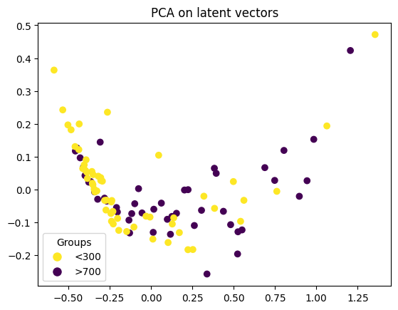
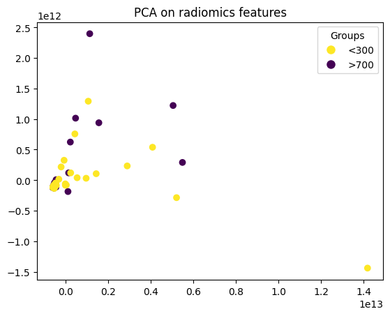

### Нужно поменять config.yaml для работы preprocessing
# Структура проекта:
 - StudCampAE-256/128 - ноутбук для тренировки автоэнкодера.
 - Evaluation - scores, feature selection, pca analysis
 - Classic models - scores, features selection, models
 - StatTests - делает xlsx файл со сравнением двух групп, для этого нужно только csv, надо поменять kaggle/input на свои данные.
 - Dataloader - загрузка данных в torch тензоры
 - Generate data 3d volumes - генерация аугментированных данных

# Почему AutoEncoder?
 - 4M/16M параметров модель, обучающаяся восстанавливать изображения из их сжатого "латентного" представления, не требует разметки классов.
 - Используются не полные МРТ сканы мозга, а лишь малая часть этих сканов, содержащая опухоль и симметрично дополненные нулями до фиксированного размера.
 - Можно использовать все данные для обучения, а не только размеченные.
 - Обучается с дополнительным triplet loss с косинусной мерой близости, благодаря чему обучается *раздивигать границу классов*, делая предсказания на этих признаках *более доверительными*
 - - Малый размер модели очень важен, чтобы она не переобучилась на triplet loss и генерализировалась на out-of-train данные.
   - Пример, как модель справилась с неразмеченными данными и обычные автосгенерированные radiomics признаки:
   -  
